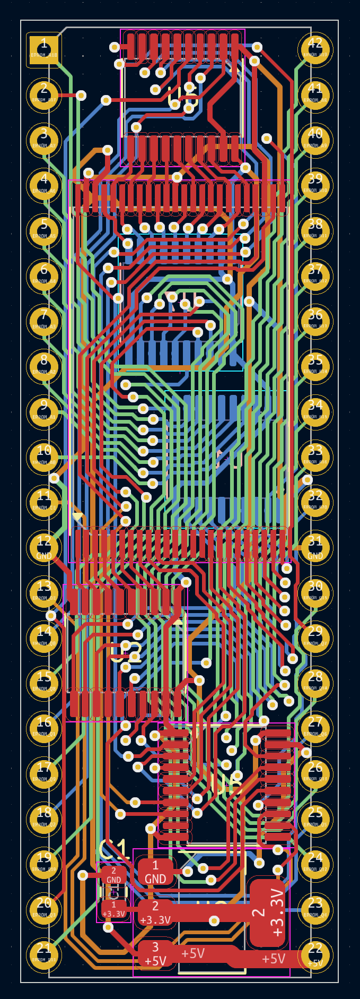

# NOR2EPROM
This is a "simple" drop in replacement for 27C322 UV EPROMs which uses an MX29LV320 (or pin-compatible) NOR flash.
Address lines are shifted from 5V -> 3.3V using 3x 74LVC245 and data lines are shifted from 3.3V -> 5V using 2x 74HCT245.

### Schematic

### PCB

